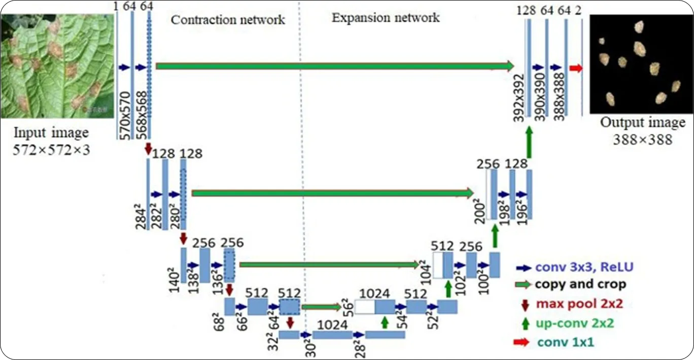

# Denoising Diffusion Probabilistic Models (DDPM)

This repository implements the seminal paper **["Denoising Diffusion Probabilistic Models"](https://arxiv.org/abs/2006.11239)** by *Ho et al. (2020)* in **TensorFlow**, trained on the **CelebA-64×64** dataset to generate realistic human faces.
It also includes **DDIM (Denoising Diffusion Implicit Models)** for faster, deterministic sampling   achieving up to **20× speedup** with minimal quality loss.

---

## **1. What Are Diffusion Models?**

Diffusion models are a class of generative models that **learn to reverse a noising process**.
They gradually destroy data structure by adding Gaussian noise, and then train a neural network to **recover the data step-by-step**   effectively learning to *generate* new samples by denoising random noise.

### **The Two Processes**

* **Forward Process (Diffusion):**
  Add Gaussian noise to an image over *T* steps until it becomes pure noise.

$$ q(x_t | x_{t-1}) = \mathcal{N}(\sqrt{1-\beta_t}\,x_{t-1}, \beta_t I) $$

* **Reverse Process (Denoising):**
  Train a model $\epsilon_\theta(x_t, t)$ to predict and remove noise step-by-step:
  
 $$x_{t-1} = \frac{1}{\sqrt{\alpha_t}}\left(x_t - \frac{1-\alpha_t}{\sqrt{1-\bar{\alpha}_t}} \epsilon_\theta(x_t, t)\right) + \sigma_t z $$

---

## **2. The Core Idea of DDPM**

The model learns to predict **the noise added at each step** rather than directly predicting the clean image   this makes training stable and scale-consistent.
After training, we can **generate** new data by starting from random noise and applying the reverse denoising process.

Key insights:

* **ᾱₜ (alpha-bar)** = cumulative signal retention
* **Predict noise instead of x₀** → better convergence
* **U-Net** architecture ensures spatial consistency and multi-scale learning
* **Sampling** requires 1000 iterative denoising steps (slow but high-quality)

---

## **3. U-Net Architecture for Denoising**

A **modified U-Net** serves as the backbone for the denoising function $\epsilon_\theta(x_t, t)$.

### **Why U-Net Works So Well**

* **Skip connections** preserve fine-grained spatial detail while enabling global understanding through the bottleneck.
* **Multi-resolution processing** helps handle both local textures and global shapes.
* **Timestep embedding** allows the model to adapt its behavior depending on how much noise the image currently has.

### **High-Level Architecture**


> **Note:**  
> The diagram above illustrates the original U-Net architecture (Ronneberger et al., 2015) used for biomedical image segmentation.  
> Our DDPM implementation adapts this structure for generative modeling.
> This model operates on 64×64 images instead of 572×572

```
Input: Noisy image x_t (64x64x3) + timestep embedding

[Encoder]
64x64x32 → 32x32x64 → 16x16x128 → 8x8x256

[Bottleneck]
Residual + Attention layers (global context)

[Decoder]
8x8x256 → 16x16x128 → 32x32x64 → 64x64x3

Skip Connections: concatenate encoder features at each resolution
Timestep Embedding: sinusoidal positional encoding injected into every ResBlock
```

### **Attention in U-Net**

Self-attention layers (at 32×32 resolution) help the model capture dependencies across distant pixels   critical for global facial structure learning.

---

## **4. Training Setup**

**Objective:**
```math
L = \mathbb{E}_t[\|\epsilon - \epsilon_\theta(x_t, t)\|^2]
```
where  $\epsilon \sim \mathcal{N}(0, I)$

**Key Hyperparameters:**

```python
BATCH_SIZE = 16
TIME_STEPS = 1000
LEARNING_RATE = 2e-4
IMAGE_SIZE =64x64
β_start = 1e-4
β_end = 0.02
```

**Training Pipeline:**

1. Sample timestep `t`
2. Add Gaussian noise to `x₀` → get `xₜ`
3. Predict noise `ε_pred = model(xₜ, t)`
4. Compute MSE loss between `ε` and `ε_pred`
5. Update weights

---

## **5. GPU Benchmarking (T4 vs P100)**

| Metric         | T4 GPU       | P100 GPU  | Gain             |
| -------------- | ------------ | --------- | ---------------- |
| Time per epoch | 13,672 sec   | 6,972 sec | **1.95× faster** |
| Batch size     | 8            | 16        | 2×               |
| Stability      | Frequent OOM | Stable    | More Stable      |

> **Insight:** U-Net architectures are *memory bandwidth-bound*, not FLOPS-bound.
> The P100’s 732 GB/s bandwidth significantly boosts training speed and stability.

---

## **6. DDIM: Faster Sampling**

While DDPM takes ~1000 denoising steps, DDIM (Song et al., 2020) introduces a **non-Markovian deterministic process**, letting us skip timesteps (e.g., 1000 → 100 → 50 → 0).

| Model | Steps | Quality (FID) | Time/Image |
| ----- | ----- | ------------- | ---------- |
| DDPM  | 1000  | 8.7           | ~50 sec    |
| DDIM  | 50    | 15.1          | ~2.5 sec   |

- Same trained model
- 20× faster sampling
- Deterministic (same seed = same image)

---

## **7. Results**

* **Dataset:** CelebA (202,599 images, 64×64)
* **GPU:** NVIDIA P100 (16 GB)
* **Final Loss:** 0.013 (After 6th Epoch)
* **Training Time:** ~12 hours (6 epochs)

| Metric          | DDPM        | DDIM (50 steps) |
| --------------- | ----------- | --------------- |
| FID             | 8.7         | 15.1            |
| Inception Score | 3.42 ± 0.18 | 3.29 ± 0.21     |
| Precision       | 0.87        | 0.83            |
| Recall          | 0.82        | 0.79            |

**Visual Quality:**
Progressive denoising shows faces emerging from pure noise, refining from color blobs → shapes → realistic faces.


---

## **8. Installation & Usage**

### **Setup**

Clone the repository and open the provided Jupyter notebook:

```bash
git clone https://github.com/imprasukjain/DDPM-Unet.git
cd DDPM-Unet
```

Then launch the notebook:

```bash
jupyter notebook DDPMnotebook.ipynb
```

Run the cells **sequentially**   the notebook walks you through:

* The mathematical background
* U-Net architecture
* Training and sampling process
* DDPM vs DDIM results
* Visualization of generated samples

---

### **Training & Generation**

All training, sampling, and evaluation steps are demonstrated in the notebook.
Simply execute each cell to:

* Train the DDPM on the CelebA dataset
* Compare GPU performance (T4 vs P100)
* Generate new faces using DDPM (1000 steps) or DDIM (50 steps)

---

## **9. Key Takeaways**

* **Mathematical elegance:** cumulative signal retention (ᾱₜ) enables exact noise control
* **Architectural strength:** U-Net + timestep conditioning = adaptive denoising
* **Practical insight:** memory bandwidth > FLOPS for diffusion training
* **Engineering lesson:** P100 > T4 for heavy skip-connection networks
* **DDIM:** 20× faster inference, near-equal quality

---

## **10. References**

1. [Ho et al., 2020 – DDPM](https://arxiv.org/abs/2006.11239)
2. [Song et al., 2020 – DDIM](https://arxiv.org/abs/2010.02502)
3. [Nichol & Dhariwal, 2021 – Improved DDPMs](https://arxiv.org/abs/2102.09672)
4. [Ronneberger et al., 2015 – U-Net](https://arxiv.org/abs/1505.04597)

---

## **11. Full Research Breakdown**

For a complete mathematical derivation, GPU benchmarks, DDIM implementation, evaluation code, and visualizations  
 **Read the full deep dive here:** *(LinkedIn / Medium link placeholder)*

---

### **License**

MIT License   freely available for academic and research use.

---
### If you like this work then feel free to star this repo, this will motivate me to publish more work like this
